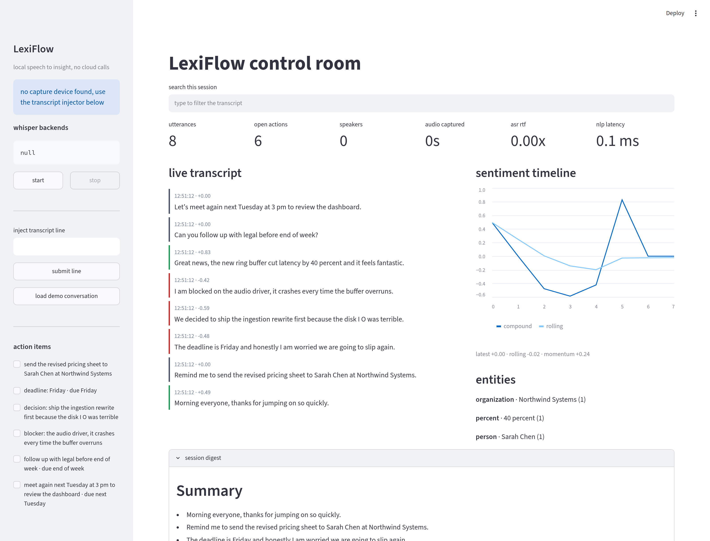
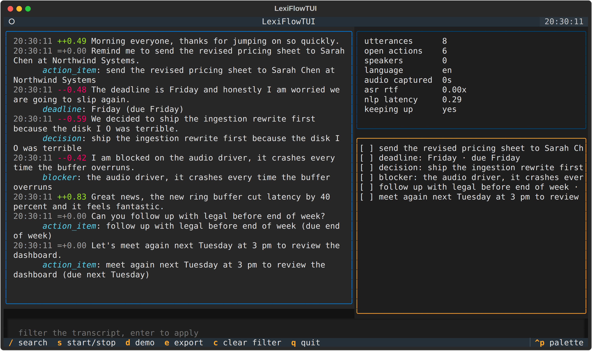

# LexiFlow

[](https://github.com/Abdus-Sami01/LexiFlow/actions/workflows/ci.yml)
[](https://www.python.org/downloads/)
[](LICENSE)
[](https://github.com/astral-sh/ruff)
[](#)

Real-time speech to structured insight, running entirely on your own CPU. Audio never leaves the
machine, nothing is written to disk mid-stream, and there is no API key anywhere in the codebase.



Prefer the terminal? Same engine, same keystrokes away:



```
microphone ──► ring buffer ──► segmenter ──► whisper.cpp ──► analytics ──► state ──► dashboard
   thread 1                     │             thread 2        thread 3            read-only
                                └── partial hypotheses every 2s, dropped under backpressure
```

## What it does

- Captures raw microphone bytes straight into a pre-allocated RAM ring buffer, converts them to the
  16 kHz mono float32 layout Whisper requires, and cuts them into utterance-sized segments with an
  adaptive noise floor. No `.wav` files, no disk I/O in the hot path.
- Runs Whisper through native bindings (`pywhispercpp`, `whisper-cpp-python` or `faster-whisper`),
  passing the numpy array directly to C++ instead of shelling out to a binary.
- Extracts action items, deadlines, blockers, decisions, entities and sentiment from each line in
  well under a millisecond, using regex rules, a small spaCy model and a lexicon-based scorer.
  English, Spanish, French, German, Italian and Portuguese each have their own rule pack and
  valence lexicon; the language is detected per line and the analytics step aside entirely for
  anything else rather than emitting nonsense.
- Attributes each utterance to a speaker with online MFCC clustering: a numpy mel-filterbank and
  DCT frontend feeds cosine-similarity centroids that grow as new voices appear. When two people
  speak inside one segment it finds the change point and splits the segment there. Name a cluster
  once and the voiceprint is saved, so the same person keeps that name in later sessions.
- Translates locally, two ways: Whisper's own translate task turns any supported language into
  English straight from the audio, and Argos/OPUS-MT models handle text between any installed
  pair. When a language has no rule pack, the analytics run on the translation instead of giving
  up, so a Dutch meeting still yields English action items.
- Summarises the session on demand with TextRank over a sentence-similarity graph, ranks keyphrases
  with RAKE, and flags topic changes by cosine distance between rolling word windows.
- Streams partial hypotheses while someone is still talking, so the transcript ticker updates
  mid-sentence instead of waiting for the pause. A governor drops them the moment the measured
  realtime factor says inference is falling behind, so they can never delay a final result.
- Gates the segmenter on spectral shape as well as loudness, so a fan, hiss or air conditioning
  no longer opens a segment the way a plain energy threshold would.
- Keeps the microphone, inference and analytics on three isolated threads joined by bounded queues,
  so a slow transcription pass can never drop audio.
- Ships two dashboards over the same engine: a Streamlit one with a live transcript, action-item
  checklist, sentiment timeline, speaker share bars, topic-shift log, digest and cross-session
  search, and a Textual one for the terminal with the same panels on single-key bindings.

## Install

```bash
pip install -e ".[all]"          # everything
pip install -e ".[audio,ui]"     # capture + dashboards, bring your own ASR
pip install -e ".[translate]"    # offline Argos/OPUS-MT translation
python -m spacy download en_core_web_sm
```

Only `numpy` is mandatory. Every optional dependency degrades gracefully: without `sounddevice` you
can still replay files and inject text, without a Whisper backend the pipeline runs with the null
backend, and without spaCy or vaderSentiment the bundled regex and lexicon paths take over.

## Use

```bash
python -m lexiflow doctor              # hardware, backends, devices
python -m lexiflow models list         # catalogue of ggml weights and what is installed
python -m lexiflow models get base.en  # download it, resumable, into ~/.lexiflow/models
python -m lexiflow build               # tuned whisper.cpp build command for this machine
python -m lexiflow devices             # list input devices
python -m lexiflow run --model base.en
python -m lexiflow replay meeting.wav --model base.en   # drains the queue before exit
python -m lexiflow demo                # analytics over a sample conversation, no audio needed
python -m lexiflow dashboard           # Streamlit UI on :8501
python -m lexiflow tui                 # terminal dashboard, no browser
python -m lexiflow bench               # time every stage, --json for machine output
python -m lexiflow sessions            # list everything recorded so far
python -m lexiflow search "budget"     # full-text search across every session
python -m lexiflow digest              # summarise the most recent session
python -m lexiflow export --format srt --format md --output notes
python -m lexiflow export --format srt --words --output captions
python -m lexiflow translate pairs           # what can be translated offline right now
python -m lexiflow translate install es-en   # one download, then never again
python -m lexiflow translate session         # print a session with translations
python -m lexiflow translate text "hola mundo"
python -m lexiflow export --format srt --translated --output subs-en
```

Translation is off by default. Turn it on with `translation.enabled = true` and a
`translation.target_language`. Into English it prefers Whisper's own translate task, which reads
the audio directly and beats translating our own transcript; for any other target, or when the
backend cannot translate, it falls back to Argos. Every line is cached, failures degrade to the
untranslated original, and nothing leaves the machine.

`--model` takes either a catalogue name (`base.en`) or a path to a `.bin`. Names resolve against
`~/.lexiflow/models`, overridable with `LEXIFLOW_MODELS`; a missing model tells you the exact
command to fetch it instead of failing deep inside the backend.

Exports cover `srt`, `vtt`, `txt`, `md` and `json`. `--words` emits one cue per word wherever the
backend gave word timings, otherwise it falls back to segment timings. Subtitle cues are made monotonic and
non-overlapping, and short utterances get a minimum on-screen duration, so the files load cleanly
in players that reject overlapping cues. The markdown export is a meeting-note document: summary,
keyphrases, action-item checkboxes, speaker table, entities and the full transcript. The same five
formats are one click away in the dashboard's session digest panel.

As a library:

```python
from lexiflow import LexiFlowConfig, LexiFlowPipeline

config = LexiFlowConfig()
config.asr.model_path = "models/ggml-base.en.bin"

with LexiFlowPipeline(config) as pipeline:
    pipeline.subscribe(lambda event, item: print(item.text))
    input("recording, press enter to stop\n")

print(pipeline.digest().as_markdown())
print(pipeline.store.speakers())
print(pipeline.store.export_json())
```

## Docker

```bash
docker build -t lexiflow .
docker run --rm -p 8501:8501 -v lexiflow-data:/data lexiflow
```

The image ships the dashboard on `0.0.0.0:8501` and keeps sessions and models in the `/data`
volume. Microphone capture inside a container needs the host's audio device passed through, which
is platform specific; file replay and text injection work out of the box.

## Building whisper.cpp for your CPU

Generic wheels are compiled for the lowest common denominator. `python -m lexiflow build` inspects
the host and prints the matching CMake invocation: AVX2/AVX512 plus OpenMP on Intel and AMD, the
Accelerate framework plus Metal on Apple Silicon.

```bash
git clone https://github.com/ggerganov/whisper.cpp
eval "$(python -m lexiflow build)"
bash whisper.cpp/models/download-ggml-model.sh base.en
```

## Measured cost

`python -m lexiflow bench` times every stage the project owns. On the CI-class Linux box these
numbers came from (4 cores, no GPU, `--iterations 20`):

| stage | cost | |
| --- | --- | --- |
| `ring buffer write` | 0.022 ms | per 30 ms block |
| `ring buffer read` | 0.002 ms | per 30 ms block |
| `resample 44.1k->16k` | 0.220 ms | per 2 s of audio |
| `spectral gate` | 0.072 ms | per frame |
| `segmenter` | 0.128 ms | per 30 ms block |
| `mfcc + embedding` | 2.510 ms | per 2 s utterance |
| `analytics` | 0.096 ms | per line |
| `digest` | 0.463 ms | per session |

Everything except the Whisper model costs about **0.6% of one core** in realtime terms: 0.47% for
the capture path and 0.12% for diarization. The model is the entire budget, which is why the
choice of model, not this code, decides whether you keep up. `--json` emits the same numbers for
tracking over time.

## Configuration

Every knob lives in `lexiflow/config.py` and can be loaded from JSON:

```bash
python -m lexiflow --config my-settings.json run
```

The sections are `audio` (sample rates, block size, ring buffer length), `segmenter` (min/max
segment length, silence hangover, noise floor adaptation, spectral gate thresholds, partial
interval), `diarization` (similarity threshold, speaker cap, change-point splitting, saved
voiceprints), `asr` (backend, model, threads, beam size, word timestamps, realtime-factor
ceiling), `nlp` (which analyzers to enable, language detection, topic window, summary length),
`translation` (on/off, target language, backend, whether to analyse the translation) and `state`
(database path, retention).

Every advanced stage can be switched off independently. `segmenter.emit_partials = false` halves
CPU use on a slow machine, `segmenter.spectral_gate = false` returns to plain energy gating,
`diarization.enabled = false` skips the MFCC pass, `diarization.split_on_change = false` keeps
segments whole, and `nlp.detect_language = false` pins the analytics to one language. The rest of
the pipeline is unaffected.

## Layout

| Path | Phase | Contents |
| --- | --- | --- |
| `lexiflow/audio/` | 1 | ring buffer, format conversion, segmenter, capture thread, speaker tracker |
| `lexiflow/asr/` | 2 | hardware detection, native backends, transcription thread |
| `lexiflow/nlp/` | 3 | rules, entities, sentiment, summarisation, language routing, translation |
| `lexiflow/state/` | 4 | thread-safe store, SQLite persistence and search, analytics thread |
| `lexiflow/ui/` | 5 | Streamlit dashboard and Textual terminal dashboard |
| `lexiflow/export.py` | — | srt, vtt, txt, markdown and json writers |
| `lexiflow/pipeline.py` | — | orchestrator that owns the three threads and both queues |
| `lexiflow/observability.py` | — | the counted, named record of every recovered failure |

## Tests

```bash
python -m pytest -q
python -m ruff check .
```

173 tests cover the ring buffer, resampling, segmentation, the spectral gate against real noise
and rumble, partial emission and the realtime-factor governor, every rule family in four
languages, language detection and its refusal to guess, sentiment negation and momentum, the MFCC
frontend, speaker clustering, change-point splitting and voiceprint round-trips, TextRank, RAKE,
topic drift, filler compression, subtitle cue timing from backend spans, every export format, the
model catalogue, the store's persistence and cross-session search, queue draining against a
deliberately slow backend, the terminal dashboard driven headlessly through its key bindings,
the translation engine's caching, failure handling and fallback to analysing a translation,
the offline guarantees above, a paced two-minute soak that loses nothing and an overload soak that
sheds frames without allocating, fault injection into the store, its listeners and its search, and
full audio-to-insight passes through all three threads.

## When something goes wrong

Every stage is built to survive a fault: a failed SQLite write must not kill the microphone
thread, and a translator that throws must not lose the transcript. That used to be spelled
`except: pass`, which meant a full disk at minute forty looked exactly like a healthy session.

Those failures are still swallowed, but now they are counted and named. `pipeline.health()`
carries `failures` and `failures_by_component`, both dashboards show a panel when the count is
non-zero, `doctor` prints the running total, and the CLI writes a one-line summary to stderr on
exit. `--verbose` logs each one as it happens; `--quiet` keeps only hard errors.

A database that cannot be opened at all downgrades the session to memory-only and says so, rather
than taking the process down with it. Missing optional dependencies are not failures — they are
reported as backend state (`entities: regex`) because that is what they are.

## Offline guarantees

"Local" is a claim worth testing rather than asserting, so the suite tests it:

- Every outbound socket call is monkeypatched to raise, then a full audio-to-insight run, the
  analytics layer in three languages, all five export formats and both search paths are exercised.
  Any accidental network call fails the test rather than passing quietly.
- With `state.persist = false` the state directory stays completely empty.
- No audio file of any format is ever produced, even mid-stream.
- The ring buffer's allocation is checked to be identical after 60 utterances of overload, and it
  sheds frames instead of growing.
- Transcript retention is capped, so a session that runs all day cannot exhaust memory.

The only network access anywhere in the project is explicit and one-off: `models get` downloading
Whisper weights and `translate install` downloading a language pair. Neither runs unless you ask.

## Limitations

What is still true, stated plainly:

- **Analytics covers six languages natively, and the rest through translation.** English,
  Spanish, French, German, Italian and Portuguese have their own rule packs and lexicons. For
  anything else, enabling translation lets the analytics run on the English translation instead;
  with translation off they switch themselves off rather than emit nonsense. Adding a native
  language means adding a lexicon and a rule pack to `lexiflow/nlp/multilingual.py`.
- **Translation quality is the model's, not ours.** Whisper's translate task and the OPUS-MT
  models are solid for meeting speech but will miss idiom and proper nouns, and translating into
  English costs a second inference pass per utterance. Argos needs its language pair downloaded
  once before it works offline forever after.
- **Language detection is sticky by design.** It weighs the last few lines so one odd sentence
  cannot flip the session, which means a genuine mid-meeting language switch takes a few lines to
  register.
- **The non-English sentiment lexicons are compact.** Roughly fifty hand-picked terms each,
  against a few thousand for English via vaderSentiment. They get the polarity right on clear
  statements and will miss subtler wording.
- **Speaker attribution is still unsupervised.** Distinct voices separate cleanly and mid-segment
  changes are now split, but genuinely simultaneous speech is one waveform and cannot be
  un-mixed by clustering. Very similar voices can merge into one cluster. Labels are per segment,
  not per word.
- **The spectral gate rejects noise, not music.** Fans, hiss and broadband noise are filtered by
  flatness and zero-crossing rate. Tonal music sits in the same part of the feature space as
  voiced speech and will still open a segment.
- **Summarisation is extractive.** TextRank picks the most central sentences actually spoken and
  strips verbal filler from them; it never writes a sentence nobody said. Genuine abstraction
  needs a language model, which would break the zero-cloud promise this project is built on.
- **Latency still depends on the model.** That is arithmetic, not a bug: `base.en` runs faster
  than realtime on a modern laptop, `large-v3` does not. What is handled is the consequence —
  the pipeline measures its own realtime factor, sheds partials when it slips, and reports
  `keeping_up: false` instead of silently building a backlog.

## Roadmap

- Word-level speaker attribution rather than per segment
- A small on-device model for genuinely abstractive summaries, kept optional
- Native rule packs for the languages currently served by translation

## License

MIT
